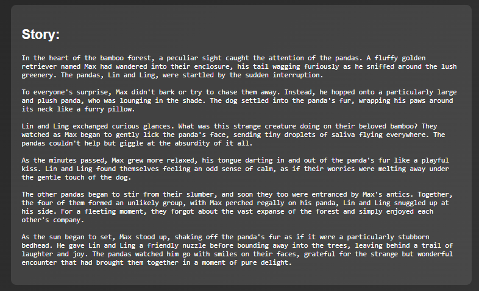
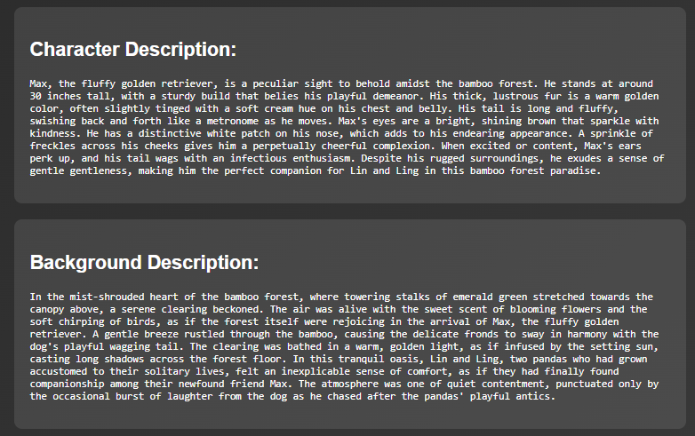
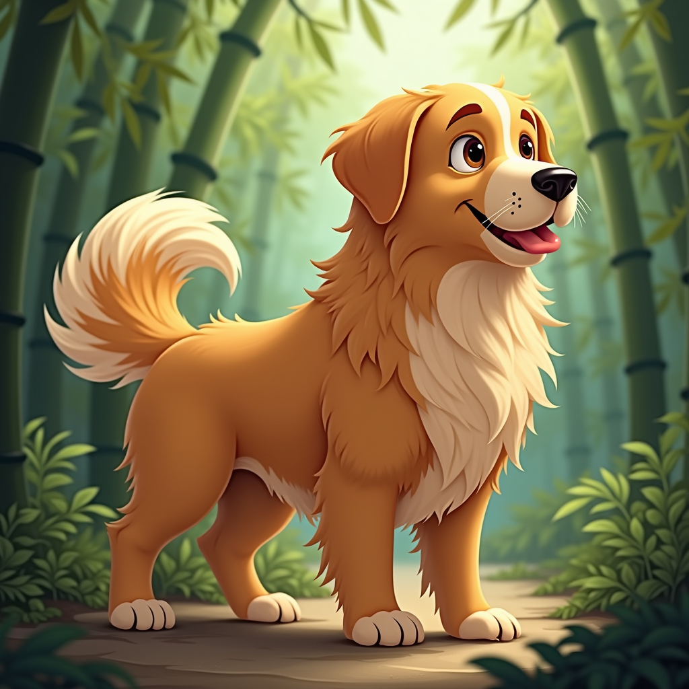

# Story Image Generator

**Internship Task:** IISc Aerospace Engineering Department – Creative Assignment
**Author:** Rajarshi Datta
**Date:** August 2025

---

## **Project Overview**

This project is a **FastAPI web application** that leverages **LangChain** and **Ollama LLM's llama3.2:1b model** to generate a **short story**, **character description**, and **background description** from a user prompt. It then uses the descriptions to generate **character and background images**, merges them into a **single coherent scene**, and displays everything in a single-page web interface using **black-forest-labs/FLUX.1-dev**.

Key features:

* Creative story generation from a text prompt.
* Detailed character and background descriptions.
* AI-generated images for character and scene using Hugging Face models.
* Merging of character and background into a unified visual scene.
* Clean and responsive frontend using HTML + CSS integrated with FastAPI.

---

## **Architecture Overview**

```
User Prompt
    │
    ▼
[FastAPI Backend] ──> [LangChain + Ollama]
    │                    │
    │                    ├─ Generates Short Story
    │                    ├─ Generates Character Description
    │                    └─ Generates Background Description
    │
    ▼
[Image Generation via Hugging Face]
    ├─ Character Image (from Character Description)
    └─ Background Image (from Background Description)
    │
    ▼
[PIL Image Merge]
    └─ Single unified scene
    │
    ▼
[Frontend]
    ├─ Displays Story
    ├─ Character & Background Descriptions
    └─ Merged Scene Image
```

---

## **Setup Instructions**

1. **Clone the repository**

```bash
git clone https://github.com/yourusername/story_image_generator.git
cd story_image_generator
```

-> **If you don't have ollama installed.**
   a. Go to https://ollama.com/download/windows
   b. Download.
   c. After downloading, go to cmd and type:
```bash
         ollama pull llama3.2:1b
```

```bash
git clone https://github.com/yourusername/story_image_generator.git
cd story_image_generator
```

2. **Create a virtual environment and activate it**

```bash
python -m venv venv
source venv/bin/activate   # Linux/Mac
venv\Scripts\activate      # Windows
```

3. **Install dependencies**

```bash
pip install -r requirements.txt
```

4. **Set up environment variables**

Create a `.env` file in the root directory with:

```bash
HF_TOKEN=hf_your_huggingface_token
```

5. **Run the application**

```bash
python app.py
```

Open your browser at [http://127.0.0.1:8000](http://127.0.0.1:8000).

---

## **Project Structure**

```
.
├── app.py                 # FastAPI backend and LangChain orchestration
├── static/                # Folder for generated images
├── templates/             # HTML templates directory
│   └── index.html
├── requirements.txt       # Python dependencies
├── README.md              # This file
└── .env                   # Environment variables (HF_TOKEN)
```

## **Sample Workflow**

**User Prompt:**
*"A dog sitting on a panda"*

**Generated Outputs:**

Story Prompt:

Background Prompt:


Generated images:
1) Character:


2) Background:


3) Merged:


---

## **Dependencies**

* FastAPI
* Jinja2
* langchain-ollama
* huggingface\_hub
* Pillow
* python-dotenv

---

